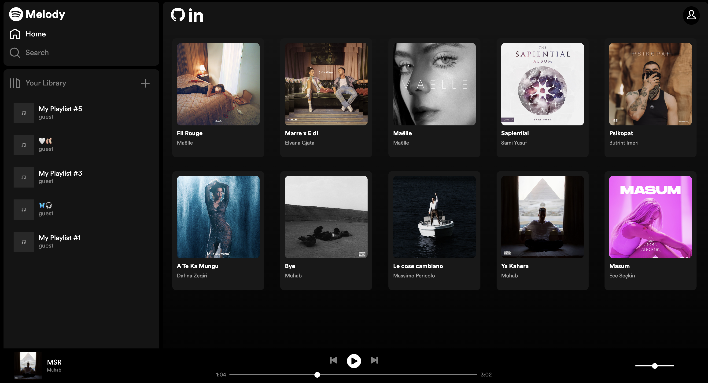

# Melody

[Melody](https://melody-y6yi.onrender.com/), a Spotify clone, is a music streaming platform that lets users listen to a vast library of songs, create playlists, and enjoy a seamless music playback experience.



## Technologies, Libraries, APIs
### Melody leverages the following technologies:
- Frontend: React, Redux, Javascript, HTML, and CSS
- Backend: Ruby, Ruby on Rails, and Jbuilder
- Database: PostgreSQL
- Build Tools: Webpack 
- Package Management: npm for managing project dependencies
- Cloud Services: AWS S3

## Functionality & MVPs
### In Melody, users are able to:
- Sign up, sign in, log out, or experience the platform as a guest
- Explore and play songs by clicking on an album
- Control playback with options to play, pause, rewind, skip, adjust volume, and navigate through the song using a progress bar
- Create, update, and delete personal playlists

## Implementation Details

### Managing Play State 

The playbarReducer ensures smooth transitions of the playbars's state, contributing to a seamless music playback experience.

```javascript
const playbarReducer = (state = initialState, action) => {
  switch (action.type) {
    case PLAY_QUEUE:
      return {
        ...state,
        isPlaying: true,
        currentSongId: action.data.songId,
        currentAlbumId: action.data.albumId,
      };
    case PAUSE_SONG:
      return { ...state, isPlaying: false };
    case PLAY_SONG:
      return { ...state, isPlaying: true };
    default:
      return state;
  }
};
```

### Managing Audio Playback and State Updates

These useEffect hooks collectively contribute to the dynamic and responsive management of audio playback.

```javascript
// Play/ pause audio
useEffect(() => {
  if (isAudioReady && isPlaying && currentUser) {
    audioRef.current.play();
  } else {
    audioRef.current.pause();
  }
}, [isPlaying, isAudioReady, currentUser]);

// Update src if currentSongUrl changes
useEffect(() => {
  if (currentSongUrl) {
    setIsAudioReady(false);
    audioRef.current.src = currentSongUrl;
  }
}, [currentSongUrl]);

// Update volume if volume state changes
useEffect(() => {
  if (volume) {
    audioRef.current.volume = volume;
  }
}, [isPlaying, isAudioReady, volume]);
```

### Previous and Next Song Navigation/ Song Queue Handling:

Taking into account the current song index and the total number of songs in the album efficiently handles previous and next song actions. Ensuring a smooth transition between songs.

```javascript
const handlePrevious = () => {
  const newIdx = (currentSongIdx - 1 + albumSongs.length) % albumSongs.length;
  dispatch(playQueue(albumSongs[newIdx], currentAlbumId));
};

const handleNext = () => {
  const newIdx = (currentSongIdx + 1) % albumSongs.length;
  dispatch(playQueue(albumSongs[newIdx], currentAlbumId));
};
```