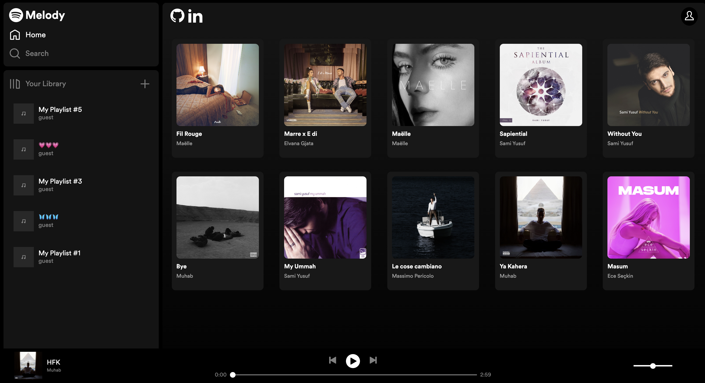

# Melody

[Melody](https://melody-0euk.onrender.com/), a Spotify clone, is a music streaming platform that lets users listen to a vast library of songs, create playlists, and enjoy a seamless music playback experience.



## Technologies, Libraries, APIs

### Melody leverages the following technologies:

- Frontend: React, Redux, Javascript, HTML, and CSS
- Backend: Ruby, Ruby on Rails, and Jbuilder
- Database: PostgreSQL
- Build Tools: Webpack
- Package Management: npm for managing project dependencies
- Cloud Services: AWS S3

## Functionality & MVPs

### In Melody, users are able to:

- Sign up, sign in, log out, or experience the platform as a guest
- Explore and play songs by clicking on an album
- Control playback with options to play, pause, rewind, skip, adjust volume, and navigate through the song using a progress bar
- Create, update, and delete personal playlists

## Implementation Details

### Managing Play State

The playbarReducer ensures smooth transitions of the playbars's state, contributing to a seamless music playback experience.

```javascript
const playbarReducer = (state = initialState, action) => {
  switch (action.type) {
    case PLAY_SONG:
      return { ...state, isPlaying: true };
    case PAUSE_SONG:
      return { ...state, isPlaying: false };
    case PLAY_QUEUE:
      return {
        ...state,
        queue: action.songIds,
        isPlaying: true,
        currentQueueIdx: action.currentQueueIdx,
      };
    case PLAY_PREV:
      const newSongIdx = (state.currentQueueIdx - 1 + state.queue?.length) % state.queue?.length;
      return { ...state, currentQueueIdx: newSongIdx };
    case PLAY_NEXT:
      const newIdx = (state.currentQueueIdx + 1) % state.queue?.length;
      return { ...state, currentQueueIdx: newIdx };
    case UPDATE_VOLUME:
      return { ...state, volume: action.volume };
    case REMOVE_CURRENT_USER:
      return initialState;
    default:
      return state;
  }
};
```

### Managing Audio Playback and State Updates

These useEffect hooks collectively contribute to the dynamic and responsive management of audio playback.

```javascript
// Play/ pause audio
useEffect(() => {
  if (isAudioReady && isPlaying && currentUser) {
    audioRef.current.play();
  } else {
    audioRef.current.pause();
  }
}, [isPlaying, isAudioReady, currentUser]);

// Update src if currentSongUrl changes
useEffect(() => {
  if (currentSongUrl) {
    setIsAudioReady(false);
    audioRef.current.src = currentSongUrl;
  }
}, [currentSongUrl]);

// Update volume if volume state changes
useEffect(() => {
  if (volume) {
    audioRef.current.volume = volume;
  }
}, [isPlaying, isAudioReady, volume]);
```

### Queue Handling:

Taking into account the current song index and the total number of songs in the album/ playlist efficiently handles previous and next song actions. Ensuring a smooth transition between songs.

```javascript
case PLAY_PREV:
  const newSongIdx = (state.currentQueueIdx - 1 + state.queue?.length) % state.queue?.length;
  return { ...state, currentQueueIdx: newSongIdx };
case PLAY_NEXT:
  const newIdx = (state.currentQueueIdx + 1) % state.queue?.length;
  return { ...state, currentQueueIdx: newIdx };
```

### Formatting of Playlist Data:

This Jbuilder file efficiently extracts and structures playlist information, including essential details such as ID, name, and associated songs.

```ruby
# _playlist.json.jbuilder

json.extract! playlist, :id, :name, :user_id, :created_at, :updated_at
json.set! 'playlist_songs' do
    json.array! playlist.playlist_songs.pluck(:id, :song_id).map { |id, song_id| { playlist_song_id: id, song_id: song_id } }
end
```

In both the show and index views, playlists are managed with a modular and maintainable approach through the utilization of the Jbuilder partial.

```ruby
# playlists/index.json.jbuilder

@playlists.each do |playlist|
    json.set! playlist.id do
        json.partial! "api/playlists/playlist", playlist: playlist
    end
end
```

```ruby
# playlists/show.json.jbuilder

json.partial! "api/playlists/playlist", playlist: @playlist
```

## Future Implementations:

- Follow Artists/ Artist Show Page
- Like Songs/ Liked Songs Playlist
